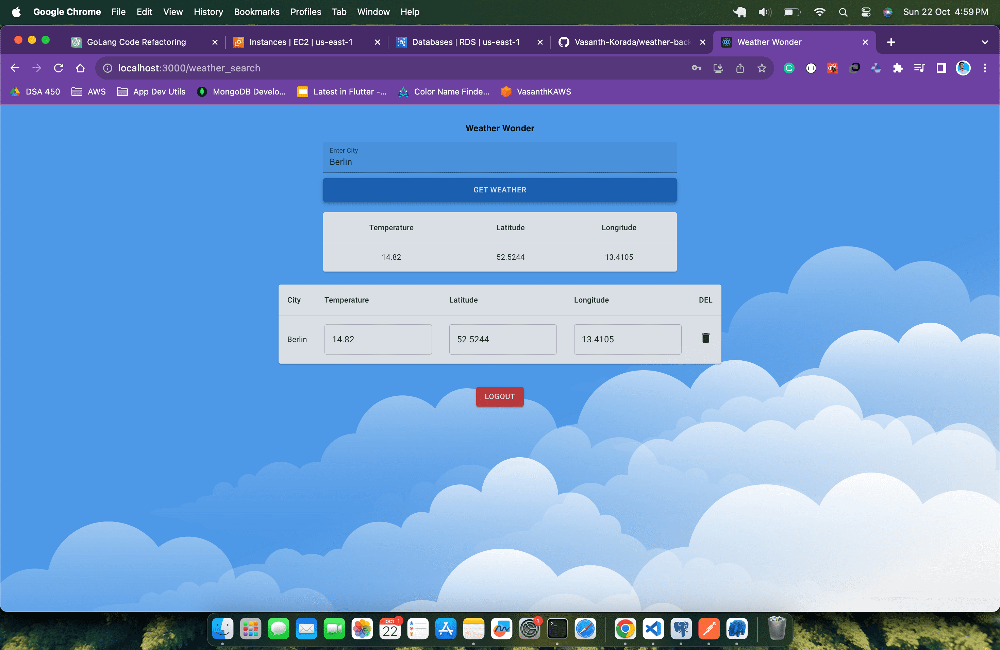
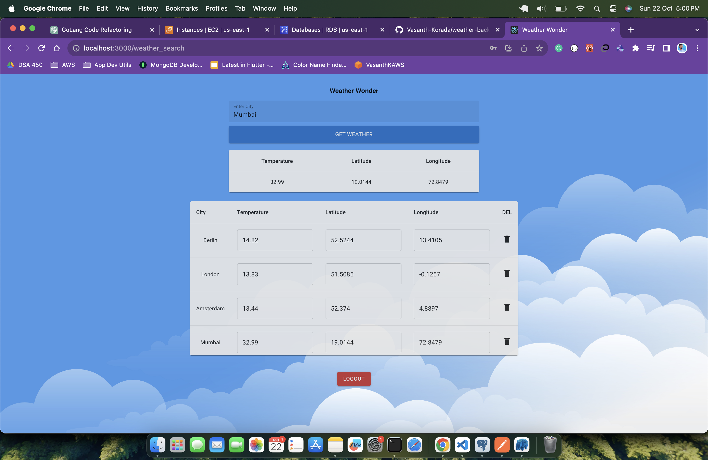

# Weather Wonder Frontend (React, MUI)

This React application serves as the frontend interface for accessing the Weather Backend Service. It offers functionalities like fetching weather details, maintaining a history of weather searches, and user management features such as login, registration, and logout.

## Features

- **User Management**: Provides registration, login, and logout capabilities.
- **Weather Search**: Allows users to search for weather details based on city names.
- **Weather History**: Users can view and manage their past weather search records.
- **CRUD Operations**: Enables creating, reading, updating, and deleting weather records via the backend API.

## Prerequisites

- Node.js 
- npm or yarn
- Weather Wonder Backend (GoLang, Postgres) (Make sure it's up and running)

## Setup & Installation

1. **Clone the Repository**:
    ```bash
    git clone https://github.com/Vasanth-Korada/weather-app-frontend.git
    cd weather-app-frontend
    ```

2. **Install Dependencies**:
    ```bash
    npm install
    # or
    yarn install
    ```

3. **Run the Application**:
    ```bash
    npm start
    # or
    yarn start
    ```

The application will start and by default run on `http://localhost:3000/`.

## Application Structure

- **API Calls**: All the backend service calls are structured and managed in the `services/AuthService.js` and `services/WeatherService.js` file.
- **Constants**: Variables like API base URL, API keys, and other constant data are managed in the `/src/utils`.
- (Mention any other significant directories or files if required)

# Screenshots






